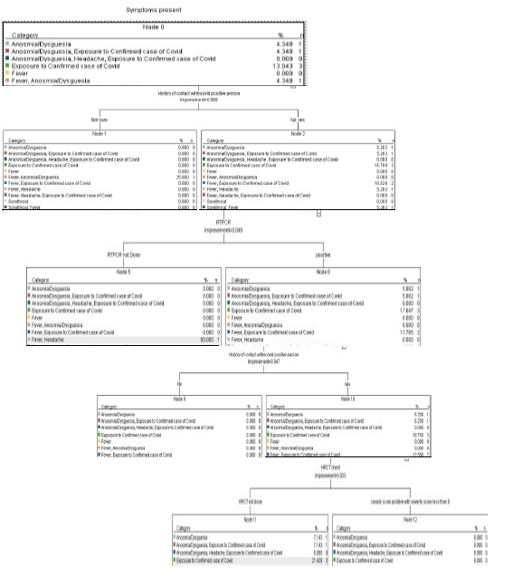

# Decision Tree Algorithm for Diagnosis and Severity Analysis of COVID-19 at Outpatient Clinic

This repository archives the decision tree methodology and clinical classification model published in the **Proceedings of Third International Conference on Computing, Communications, and Cyber-Security (IC4S 2021)**, Springer.

## Authors
* **Ritika Rathore**
* **Piyush Kumar**
* **Rushina Singhi**

---

## Abstract
This study investigates the feasibility of the decision tree algorithm (CART) for classifying participants into test-based positive and negative cases to detect COVID-19 in outpatient settings. The model evaluates parameters such as RTPCR test results, Chest X-Ray imaging, and clinical symptoms to suggest hospital admission or home isolation.

## SPSS Decision Tree Model
The decision tree was generated using **IBM SPSS** (CART algorithm) based on clinical evaluation parameters and patient history.



---

## Data Availability Statement
The primary dataset used for this study was collected during the initial wave of the COVID-19 pandemic at outpatient clinics. Due to patient privacy standards and data retention agreements, raw dataset files are not publicly hosted in this repository.

## Citation
```bibtex
@inproceedings{rathore2022decision,
  title={Decision Tree Algorithm for Diagnosis and Severity Analysis of COVID-19 at Outpatient Clinic},
  author={Rathore, Ritika and Kumar, Piyush and Singhi, Rushina},
  booktitle={Proceedings of Third International Conference on Computing, Communications, and Cyber-Security: IC4S 2021},
  pages={163--178},
  year={2022},
  publisher={Springer Nature Singapore}
}
```
